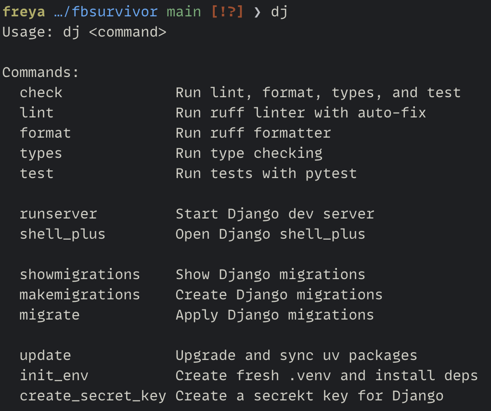

# DJ

## Why
If you work with [Python](https://python.org) and [Django](https://djangoproject.com) and use `uv`
and `ruff` from [Astral](https://astral.sh), you know the Django management commands get quite long.

Examples:  
- `uv run python manage.py runserver` without `dj`
- `dj runserver` with `dj`

Which one would you rather type several times a day?

## Install
- Copy `dj` into the root path of your django project.
- To get the best experience, you should add a couple of things to your shell configuration. For zsh, I add an alias and completions:

```shell
alias dj="./dj"
```

```shell
autoload -Uz compinit && compinit

_dj_completions() {
    local commands="check lint format types test runserver shell_plus showmigrations makemigrations migrate update init_env"
    compadd -- ${=commands}
}

compdef _dj_completions dj
```

## Usage
`dj <subcommand>`  


